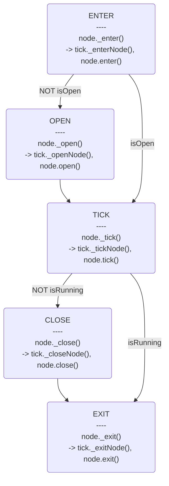

# BehaviorTree

Reference: https://github.com/behavior3/behavior3js/

## Nodes

- Composite Nodes:
    - Selector : MemSelector
    - Sequence : MemSequence
    - Parallel :
        - First child is main task
        - Return status of main task
    - IfSelector
    - SwitchSelector
    - WeightSelector : Random select a child with weight
    - ShuffleSelector : Shuffle children of selector
- Decorators:
    - If
    - Bypass
    - ForceSuccess
    - ForceFailure
    - TimeLimit
        - Return FAILURE when timeout, else return child statue
    - Cooldown : 
        - Start cooldown when child status is not RUNNING
        - Return FAILURE during cooldown, else return child statue
    - Repeat
    - RepeaterUntilFailure
    - RepeaterUntilSuccess
    - Invert
    - Limiter
- Actions:
    - Succeeder
    - Failer
    - Runner
    - Wait
    - Error
    - Abort

## Logic mapping

### If

```
if ConditionA
    TaskA
else if ConditionB
    TaskB
else
    TaskC
```

Map to

- Selector
    - if-ConditionA
        - TaskA
    - if-ConditionB
        - TaskB   
    - TaskC

### While

```
while ConditionA
    TaskA
```

Map to

- RepeaterUntilFailure
    - if-ConditionA
        - TaskA

### Tick

#### State machine

```javascript
node._execute(tick);
```



- When closing a node, also close children nodes.