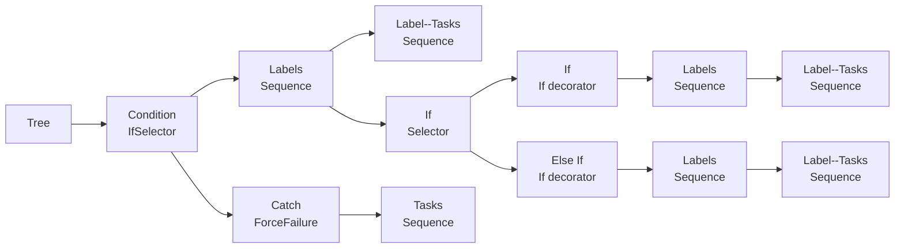

# Event sheet tree

## Tree architecture

```mermaid
graph LR
  Tree --> Condition["Condition<br>IfSelector"]
  Condition --> Labels["Labels<br>Sequence"]
  Labels --> Tasks0["Label--Tasks<br>Sequence"]
  Labels --> IfSelector["If<br>Selector"]
  IfSelector --> If["If<br>If decorator"]
  If --> IfLabels["Labels<br>Sequence"]
  IfLabels --> Tasks1["Label--Tasks<br>Sequence"]

  IfSelector --> ElseIf["Else If<br>If decorator"]
  ElseIf --> ElseIfLabels["Labels<br>Sequence"]
  ElseIfLabels --> Tasks2["Label--Tasks<br>Sequence"]

  Condition --> Catch["Catch<br>ForceFailure"]
  Catch --> CatchTasks["Tasks<br>Sequence"]
```
